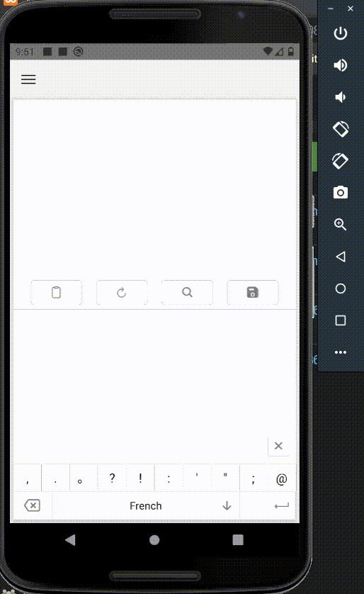

# react-native-digital-ink

React Native module for using Digital Ink Recognition of Google ML Kit

<br />

  

<br />
<br />
<br />
   


## Installation

```sh
npm install react-native-digital-ink
```

## Usage

```ts
import * as React from 'react';
import { useRef } from 'react';
import { StyleSheet, Text, TouchableOpacity, View } from 'react-native';
import DigitalInk, { DigitalInkView } from 'react-native-digital-ink';

export default function App() {
  const [result, setResult] = React.useState<void>();
  const [status, setStatus] = React.useState(true);
  const digitalInkView1: any = useRef();

  const onClick = (e: any) => {
    setStatus(!status);
    console.log('onClick', e.nativeEvent);
  };

  const onDrawStart = (e: any) => {
    console.log('onDrawStart', e.nativeEvent);
  };

  const onDrawEnd = (e: any) => {
    console.log('onDrawEnd', e.nativeEvent);
  };

  React.useEffect(() => {
    DigitalInk.show('Hello', DigitalInk.SHORT);
  }, []);

  const clearDigitalInkViewHandler = async () => {
    const languageTag = 'af';
    const result = await DigitalInk.downloadModel(languageTag);
    setResult(result);
  };

  return (
    <View style={styles.container}>
      <Text style={styles.resultText}>Result: {result}</Text>
      <DigitalInkView
        ref={digitalInkView1}
        status={status}
        onClick={onClick}
        onDrawStart={onDrawStart}
        onDrawEnd={onDrawEnd}
        style={{
          width: '90%',
          height: 400,
          backgroundColor: '#dcdcdc',
        }}
      />
      <TouchableOpacity
        style={styles.button}
        onPress={clearDigitalInkViewHandler}
      >
        <Text style={styles.buttonText}>Recognize2</Text>
      </TouchableOpacity>
    </View>
  );
}

const styles = StyleSheet.create({
  container: {
    flex: 1,
    alignItems: 'center',
    justifyContent: 'center',
  },
  button: {
    width: '80%',
    height: 45,
    marginTop: 20,
    backgroundColor: '#0387AC',
    borderRadius: 15,
    justifyContent: 'center',
    alignItems: 'center',
  },
  buttonText: {
    fontSize: 20,
    color: 'white',
  },
  resultText: {
    fontSize: 30,
    marginBottom: 15,
  },
});

```
## Methods
| Name | Description | Default |
|:-------|:------------|:----------|
| void show(String message, int duration)  | Shows a toast contains given the text |  |
| promise clear()  | Clears the Drawing pad. This returns a promise handler so you can use `await` here. |  |
| Array &lt;Language&gt; getLanguages()   | Returns languages which are supported in this Drawing Pad. This returns a promise handler so you can use `await` here. |  |
| Array &lt;Model&gt; getgetDownloadedModelLanguagesLanguages()   | Returns models which are supported in this Drawing Pad. This returns a promise handler so you can use `await` here. |  |
| void downloadModel(String languageTag)  | Downloads a specified language to be used to recognize drawings. This returns a promise handler so you can use `await` here. |  |
| void recognize()  | Anaylizes and recognizes the current drawings in the pad. This returns a promise handler so you can use `await` here. | |
| void deleteDownloadedModel()  | Deletes the downloaded model. This returns a promise handler so you can use `await` here. |  |

## Events
| Name | Description | Default |
|:-------|:------------|:----------|
| void onDownloadedModelsChanged(Set&lt;String> downloadedLanguageTags)  | Fires when it's changed downloading models. This is usefule when you need to implement a progress bar of downloaing models.|  |

## License

MIT
